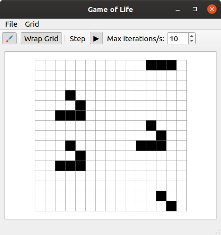

# Game of Life
*Simple Game of Life for Qt5 with a small twist*



## The twist
*Instead of the usual "fetch all neighbours around a cell", this implementation drags a 3x3 matrix around the grid*

## Features
- Resizable grid
- View dragging (hold the right mouse button down)
- View zooming (spin the scroll wheel)
- Adjustable max speed for the automatic generation stepping
- Toggleable grid wrapping
  - When enabled, have a glider hit the border and watch as it appears from the opposite side

## Requirements
- Basic C++17 build tools
- Qt5 Development tools

## Compiling on Ubuntu
### Installing the requirements
```
sudo apt install build-essential
sudo apt install qtcreator
sudo apt install qt5-default
```

### Compiling and running tests
```
cd tests
make test
```

### Compiling and running the project
```
cd build
qmake ../GameOfLife.pro
make
./GameOfLife
```

Alternatively you can just open the project file in Qt Creator and use that.

If there are any problems, please make sure you have a modern, C++17 compatible compiler. Tested with GCC 9.2.1.

### Creating documentation
#### Install doxygen (and optionally graphviz for the sweet graphs)
```
sudo apt install doxygen
sudo apt install graphviz
```

#### Run doxygen
```
doxygen doxygen.conf
```
*The documentation main page is located at doc/html/index.html*

## The directory structure
- `src/` All of the code, excluding the tests.
- `src/ui/` The code for the UI elements.
- `tests/` The tests.
- `ui/` The Qt Forms can be found in here.
- `doc/` The documentation, generated when doxygen is run.
- `build/` The build directory.
- `screenshots/` A directory for screenshots.
